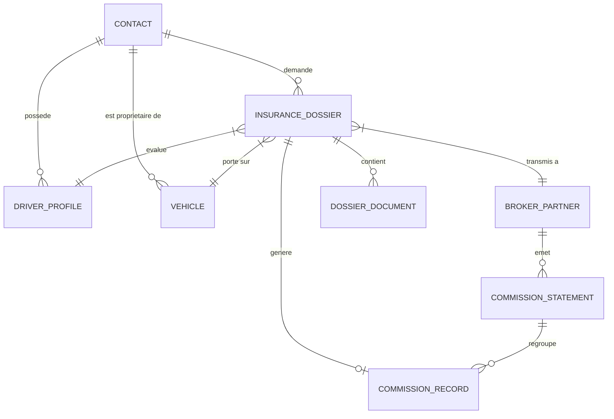

# 📐 Architecture Technique & Métier : CRM Courtier & Apporteur d'Affaires Assurance Auto

> **Projet** : `crm-nil`  
> **Socle de départ** : [Comp AI CRM (`trycompai/crm`)](https://github.com/trycompai/crm)  
> **Cible Métier** : CRM spécialisé pour courtiers & apporteurs d'affaires en assurance automobile en France  
> **Standard UI/UX** : Apple Human Interface Guidelines (HIG) & Glassmorphism  
> **Cadre Opérationnel** : Méthodologie `g-stack` & Pôles de développement spécialisés ([AGENTS.md](file:///Users/cogepart/Documents/crm-nil/AGENTS.md))

---

## 1. Vue d'Ensemble & Vision Produit

Le projet **crm-nil** a pour objectif de fournir à l'apporteur d'affaires en assurance automobile une plateforme tout-en-un, ultra-rapide et ergonomique pour :
1. **Accélérer la qualification des prospects** (acquisition en 1 clic des données carte grise via API SIV).
2. **Piloter l'instruction du dossier d'assurance** (permis, carte grise, relevé d'information avec scoring bonus/malus).
3. **Sécuriser et automatiser le commissionnement** (rapprochement automatique des bordereaux de commissions reçus des courtiers grossistes comme April, Solly Azar, Maxance, Netvox, etc.).
4. **Fidéliser et relancer intelligemment** (alertes échéances annuelles Loi Hamon à J-45).

---

## 2. Architecture Globale du Monorepo

Le projet est structuré sous la forme d'un **Monorepo Turborepo** propulsé par **Bun** :

```
crm-nil/
├── apps/
│   ├── app/                 # Frontend Next.js (App Router, React 19, Tailwind CSS, shadcn/ui Apple HIG)
│   ├── api/                 # Backend NestJS haute performance avec couche tRPC typée de bout en bout
│   └── agent/               # Couche d'orchestration des agents IA d'arrière-plan (OCR, enrichissement)
├── packages/
│   ├── db/                  # Modélisation PostgreSQL & Prisma ORM, migrations et scripts de seed
│   ├── ui/                  # Design System partagé & composants d'interface (Apple HIG & Glassmorphism)
│   ├── auth/                # Couche d'authentification et gestion des sessions (Better-Auth)
│   ├── validation/          # Schémas de validation TypeScript (Zod) partagés entre Frontend et Backend
│   ├── env/                 # Validation centralisée des variables d'environnement
│   └── typescript-config/   # Configurations TS communes (Next.js, NestJS, librairies)
├── .agents/                 # Écosystème d'ingénierie IA, compétences (skills), mémoires et règles
├── AGENTS.md                # Référentiel des 6 pôles de développement virtuels (Lead, Product, Front, Back, QA, DevOps)
├── CLAUDE.md                # Aide-mémoire commandes, navigation g-stack et workflows
└── ARCHITECTURE.md          # Le présent document d'architecture de référence
```

---

## 3. Schéma Relationnel & Modélisation Métier (Base de Données)

Le schéma PostgreSQL (`packages/db/prisma/schema.prisma`) hérite des entités génériques de Comp AI (`User`, `Contact`, `Deal`, `Activity`) et les étend avec les modèles spécifiques à l'assurance auto :



### Détail des Entités Métiers Clés :

#### A. `Vehicle` (Véhicule & Immatriculation)
- **`id`** (UUID/cuid)
- **`contactId`** (Relation `Contact`)
- **`licensePlate`** : Numéro d'immatriculation SIV (ex: `AB-123-CD`).
- **`vin`** : Numéro de série constructeur (17 caractères).
- **`brand`** & **`model`** & **`version`** : Marque, modèle et finition commerciale.
- **`firstRegistrationDate`** : Date de 1ère mise en circulation.
- **`fiscalPower`** : Puissance fiscale (CV).
- **`fuelType`** : Énergie (`ESSENCE`, `DIESEL`, `ELECTRIQUE`, `HYBRIDE`, etc.).
- **`usageType`** : Mode d'usage (`PRIVE_TRAJET`, `PROFESSIONNEL`, `TOURNÉE_COMMERCIALE`).
- **`parkingType`** : Stationnement habituel (`GARAGE_FERME`, `JARDIN_CLOS`, `VOIE_PUBLIQUE`).
- **`annualMileage`** : Tranche kilométrique annuelle estimée.
- **`sivRawData`** : Payload JSON complet retourné par l'API SIV pour traçabilité.

#### B. `DriverProfile` (Conducteur & Sinistralité)
- **`id`** (UUID/cuid)
- **`contactId`** (Relation `Contact`)
- **`licenseNumber`** : Numéro de permis de conduire.
- **`licenseDate`** : Date d'obtention du permis.
- **`licenseType`** : Catégorie (`B`, `B_AUTOMATIQUE`, `AAC`).
- **`crmCoefficient`** : Coefficient de Réduction-Majoration (ex: `0.50` = 50% bonus, `1.25` = malus).
- **`claims36Months`** : Nombre de sinistres sur 36 mois (responsables, non responsables, bris de glace, vol).
- **`insuranceHistory`** : Mois consécutifs d'assurance au cours des 3 dernières années.
- **`cancellationHistory`** : Antécédents de résiliation (`AUCUN`, `NON_PAIEMENT`, `SINISTRALITE`, `ALCOOLEMIE`).
- **`suspensionHistory`** : Historique de suspension/annulation de permis.

#### C. `InsuranceDossier` (Le Dossier d'Assurance / Deal Métier)
- **`id`** (UUID/cuid)
- **`reference`** : Numéro unique de dossier interne (ex: `DOS-2026-0042`).
- **`contactId`** & **`vehicleId`** & **`driverProfileId`**
- **`brokerPartnerId`** (Relation `BrokerPartner` - courtier grossiste récepteur).
- **`formula`** : Formule de garantie (`TIERS_SIMPLE`, `TIERS_ETENDU_VOL_INCENDIE`, `TOUS_RISQUES`).
- **`options`** : JSON (`assistance0km`, `vehiculePret`, `protectionJuridique`, `valeurMajoree`).
- **`annualPremiumTTC`** & **`annualPremiumHT`** : Prime d'assurance annuelle.
- **`status`** :
  - `PROSPECT_INITIE` : Coordonnées et véhicule saisis.
  - `PIECES_EN_ATTENTE` : Relevé d'information ou permis manquant.
  - `DOSSIER_COMPLET` : Toutes les pièces conformes réunies.
  - `DEVIS_EMIS` : Proposition tarifaire transmise au client.
  - `VALIDE_SOUSCRIT` : Contrat validé, premier paiement effectué, carte verte émise.
  - `ACTIF` : Contrat en cours d'effet.
  - `RESILIE` / `SANS_SUITE` : Affaire classée ou résiliée.
- **`anniversaryDate`** : Date d'échéance principale (déclencheur relance Loi Hamon).

#### D. `DossierDocument` (GED & Pièces Justificatives)
- **`id`** (UUID/cuid)
- **`dossierId`** (Relation `InsuranceDossier`)
- **`type`** : `PERMIS_CONDUIRE`, `CARTE_GRISE`, `RELEVE_INFORMATION`, `RIB`, `DEVIS_SIGNE`.
- **`fileUrl`** : Stockage local ou S3/Blob.
- **`ocrStatus`** : `PENDING`, `PARSED_SUCCESS`, `PARSE_ERROR`.
- **`ocrExtractedData`** : Données extraites par l'IA (nom, date de permis, bonus extrait du RI, etc.).

#### E. `BrokerPartner` (Courtiers Grossistes & Compagnies)
- **`id`** (UUID/cuid)
- **`name`** : Ex: April, Solly Azar, Maxance, Netvox, Xenassur, Axa, Allianz.
- **`portalUrl`** : Lien vers l'extranet partenaire.
- **`defaultAcquisitionCommission`** : Montant forfaitaire standard négocié (ex: 80 €).
- **`defaultRenewCommissionRate`** : Pourcentage récurrent négocié (ex: 7%).

#### F. `CommissionRecord` & `CommissionStatement` (Rapprochement Financier)
- **`CommissionStatement`** : Bordereau mensuel importé depuis un fichier Excel/CSV d'un grossiste.
- **`CommissionRecord`** :
  - Ligne de commission unitaire liée à un `InsuranceDossier`.
  - Type : `ACQUISITION` (one-shot) ou `RECURRING` (renouvellement annuel).
  - Montant attendu vs Montant réellement constaté sur le bordereau.
  - Statut : `EN_ATTENTE`, `RAPPROCHE_VALIDE`, `ANOMALIE_ECART`, `IMPAYE`.

---

## 4. Intégrations & Flux Externes

```
                   ┌──────────────────────────────────────┐
                   │           Apporteur d'Affaires       │
                   └──────────────────┬───────────────────┘
                                      │
            ┌─────────────────────────┼─────────────────────────┐
            ▼                         ▼                         ▼
   [Saisie Plaque SIV]     [Dépôt Relevé Info / CG]     [Import Bordereau Excel]
            │                         │                         │
            ▼                         ▼                         ▼
  ┌───────────────────┐     ┌───────────────────┐     ┌───────────────────┐
  │  API Plaque SIV   │     │ Agent IA Multimodal│     │  Moteur Rapprochement
  │  (Immat Auto FR)  │     │ (Vision / OCR LLM)│     │  Intelligent tRPC │
  └─────────┬─────────┘     └─────────┬─────────┘     └─────────┬─────────┘
            │                         │                         │
            └─────────────────────────┼─────────────────────────┘
                                      ▼
                           [Base PostgreSQL CRM]
```

1. **API Plaque Immatriculation (SIV)** :
   - Requête avec le numéro de plaque (ex: `AB-123-CD`).
   - Réponse : Marque, Modèle exact, Version, Date de MEC, Chevaux fiscaux (CV), Carburation.
   - Pré-remplissage instantané sans aucune faute de frappe.
2. **Extraction Documentaire Assistée par IA (Agent OCR)** :
   - Analyse automatique du Relevé d'Information (RI) pour identifier immédiatement : la date de fin du contrat précédent, le bonus/malus légal, le nombre d'accidents responsables.
3. **Moteur de Matching de Bordereaux** :
   - L'apporteur dépose le fichier `.xlsx` ou `.csv` reçu de sa compagnie en fin de mois.
   - L'algorithme réconcilie par numéro de contrat, référence dossier ou nom du client, et met en surbrillance :
     - Les commissions conformes (vertes).
     - Les écarts de montant ou commissions manquantes (rouges/oranges).

---

## 5. Design Système & Expérience Utilisateur (Apple HIG)

Conformément à la règle de design du projet ([apple-design.md](file:///Users/cogepart/Documents/crm-nil/.agents/rules/apple-design.md)) :
- **Glassmorphism & Profondeur** : Fond clair satiné / sombre minéral, cartes avec `backdrop-filter: blur(20px)`, bordures lumineuses 1px subtiles.
- **Typographie** : Police système Apple (`-apple-system`, `SF Pro Display`, `SF Pro Text`, `Inter`).
- **Courbes Organiques** : `border-radius: 16px-20px` pour les panneaux, `12px-14px` pour les champs et boutons, `9999px` pour les badges statuts.
- **Micro-Interactions** : Animations fluides avec physique de ressorts (`spring animations`), retours tactiles au clic (`transform: scale(0.98)`).
- **Vues Principales** :
  - **Dashboard Métrique** : Chiffre d'affaires commissions du mois, pipeline en cours, taux de concrétisation, dossiers bloqués sans RI.
  - **Pipeline Kanban Auto** : 6 colonnes fluides de la demande entrante jusqu'au contrat actif et payé.
  - **Fiche Dossier 360°** : Carte véhicule avec photo/modèle, informations conducteur, visionneuse PDF de pièces justificatives et historique de communication.
  - **Espace Bordereaux** : Table interactive de rapprochement bancaire et commissions.

---

## 6. Gouvernance, Roadmap & Commandes g-stack

Pour piloter l'avancement du projet, l'orchestration s'appuie sur le framework **g-stack** :

| Phase | Outils & Commandes g-stack | Rôle Responsable |
| :--- | :--- | :--- |
| **Spécifications & Données** | `/plan-eng-review`, `postgres-best-practices`, `zod-validation-expert` | Lead CTO & Backend |
| **Design & Interfaces** | `/design-consultation`, `/design-html`, `apple`, `shadcn` | Frontend & UX |
| **Validation & Tests** | `/qa`, `/qa-only`, `/browse`, `systematic-debugging` | QA & Sécurité |
| **Mise en Production** | `/review`, `/ship`, `/land-and-deploy`, `/canary` | DevOps & Release |
| **Persistance de Contexte**| Skill `mem-cp` (dans `.agents/memories/`) | Tous les agents |

---

## 7. Fichiers & Points d'Entrée Clés du Projet

- **`ARCHITECTURE.md`** : Ce document de référence technique.
- **`AGENTS.md`** : Organisation des équipes de développement spécialisées.
- **`CLAUDE.md`** : Commandes et règles d'exécution courantes.
- **`packages/db/prisma/schema.prisma`** : Schéma de données central.
- **`apps/app/src/`** : Code source de l'interface utilisateur Next.js.
- **`apps/api/src/`** : Code source des routeurs NestJS & tRPC.
